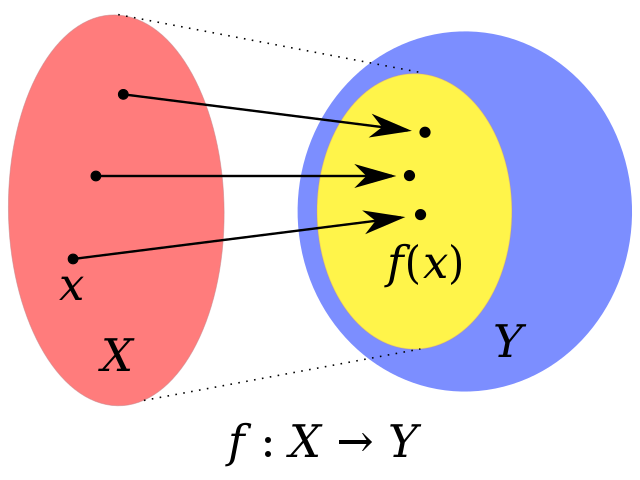

## [A collection of Either examples compared to imperative code](https://egghead.io/lessons/javascript-a-collection-of-either-examples-compared-to-imperative-code)

In this video Professor Frisby shows a few examples of code using both imperative and functional approaches.

## `openSite`
### Imperative example
```js
const openSite = (currentUser) =>
  currentUser
    ? renderPage(currentUser)
    : showLogin()
```

### Functional example
```js
const openSite = (currentUser) =>
  fromNullable(currentUser)
    .fold(showLogin, renderPage)
```
The output from the imperative or functional approach is the same. The difference is that using an `either` we can look at the code and it explains itself as

> "Hey, this value can `either` be some sort of value or not but more specifically it can `EITHER` be a `Right` (is a valid path/value) or a `Left` (something failed). We're handling the branching logic using functions and chaining (syntax sugar)." - `Either`

Again, these two examples show that the output is going to be identical. We will check the value using a regular hard-coded `if` statement or using a function that abstracts away that branching logic to allow for composition and we can then handle getting the value out using the `.fold()` method.

Toy examples aside look at the `if` and the `Either` version. The `if` version looks simpler to write. You even have snippets to use, most likely, to get that code out of the way quickly. Fair enough. But what about when you're building a page that is dynamically built. What if those functions are dynamically injected in? I believe that an `Either` would lend itself to doing this better. That's just one example.

---
## `getPrefs`
### Imperative example
```js
const getPrefs = (user) => (
  user.premium
    ? loadPrefs(user.preferances)
    : defaults
)
```

### Functional example
```js
const getPrefs = user => 
  (user.premium ? Right(user)) : Ledt('not premium'))
    .map(u => u.preferances)
    .fold(
      () => defaultPrefs,
      prefs => loadPrefs(prefs))
```

This one is harder to defend, in my opinon, because the ternary is so straight forward and easy. Thing is that things don't ever end up just being a ternary and you'll eventually need more complexity. If you keep things as many small functions then you can combine them, eventually, as in a different example below (`streetName(user)`, below in next example) to get that info out with greater ease.

Otherwise, honestly, I would just suggest the ternary version.

---
## `getPrefs`
### Imperative example
```js
const streetName = user => {
  const address = user.address

  if (address) {
    const street = adress.street
    if (street) {
      return street.name
    }
  }

  return 'no street'
}
```

### Functional example
```js
const streetName = user => (
  fromNullable(user.address)
    .chain(a => fromNullable(a.street))
    .map(s => s.name)
    .fold(e => 'no street', n +> n)
)
```
This one is a lot better. Now you're doing 2 things with some serious benefits.
1. It's all smaller functions. Much more and easier test coverage.
    - Possibly automatable
1. Everything is now safer. Two different checks that could fail and return nothing but instead we return a wrapped object (`Right`/`Left`)
    - We need to do this twice in a row but we have methods in the API to make this easier for us.
1. Much less nesting and it's much easier to read (when you know how).

One more thing to note. Say you have something like this:

```js
const foo = {
  a: {
    b: {
      c: {
        d: {
          // and so on and so forth.
        }
      }
    }
  }
}
```

This is super ugly but you could compose `fromNullable` together to get the data out. Or use something like `pathOr` from Ramda (which I would suggest now).

---
## `concatUniq`
### Imperative example
```js
const concatUniq = (x, ys) => {
  const found = ys.filter(y => y === x)[0]
  return found ? ys : ys.concat(x)
}
```

### Functional example
```js
const concatUniq = (x, ys) => (
  fromNullable(ys.filter(y => y === x)[0])
    .fold(() => ys.concat(x), ys)
)
```

I don't know which of these I prefer. I think I'll usually side on using a `Left` or `Right` for type safety but in terms of syntax or readability I feel neither win. But that's the thing though. The second one is type safe wherease the first isn't.

You'll get an error in the imperative version while the second would be safe to not break your application. Could be harder to find the info you want in this case tho.

---
## `wrapExamples`
### Imperative example
```js
const wrapExamples = example => {
  if (example.previewPath) {
    try {
      example.preview = fs.readFileSync(example.previewPath)
    }
    catch (e) { }
  }
  return example
}
```

### Functional example
```js
const readFile = (path) => tryCatch(() => fs.readFileSync(path))
const error = () => example
const example = ex => Object.assign({ preview: example.previewPath }, ex)

const wrapExamplesFunc = example =>
  fromNullable(example.previewPath)
    .chain(readFile)
    .fold(error, example)
```

This is where it gets harder to evangelize functional programming techniques. The first one everyone believes is easier to read. I disagree. Everyone also would say that it's simple, I also disagree.

If you look at code from the perspective of everything is a value then either a "primative" value like a `string`, `number`, `boolean`, `object` and so on or a mapped value such as a `function` or `object`<sup>1</sup>. Is you unpack that then that means that you can treat every function as a value (the smaller the function the easier it is to see as a value). It's easier to do this if you are passing functions around which you certainly cannot do in the first example with the exception handling done in the conditional.

------
1. I say mapped because if you view a function something that for any commbination of parameters you'll always get the same output for those parameters then that is essentially a mapping. This is purity in functions when speaking in terms of functional programming. This also means that any given pure function is referentially transparent.

Another example could be a cache. For instance you have a server that is rendering a fully HTML page on load. You put some sort of cache in front of it and therefore whenever anyone hits that resource (w/e url they hit) they get a cache. This is also `Referential Transparency`.

The image below I think explains it very well:

 <br />
\- [Wikipedia - Domain of a function](https://en.wikipedia.org/wiki/Domain_of_a_function)

For every point on the left it _maps_ to a point in Y (the codomain but that is a different topic all together).
