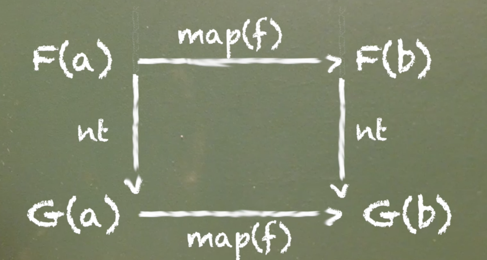

## [Principled type conversions with Natural Transformations](https://egghead.io/lessons/javascript-principled-type-conversions-with-natural-transformations)

Basically, take one functor and turn it into another. ie `Either()` into a `Maybe()` or `Either()` into a `Task()`

`F a -> G a`

Look at the code to understand it better, otherwise the only interesting part here is the law.

## Laws

`nt(x).map(f) == nt(x.map(f))`



```js
```


